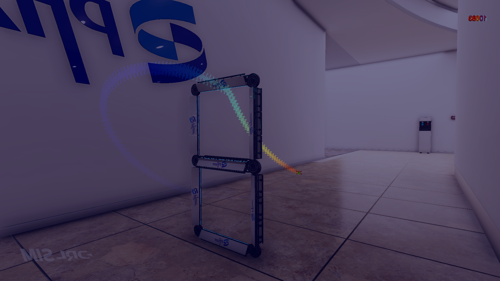

__________________________________________________________

10k ft. overview:

This repo trains a basic centernet head on top of a resnet18 backbone to detect quadcopters in frames collected from the Drone Racing League (DRL) simulator.
I use the delta between frames (event frames) to help the network learn what to focus on.


__________________________________________________________

Environment setup:

conda env create -f path/to/environment.yml (located here in directory)
conda activate drlp-env


__________________________________________________________

How to run the evaluation:

python tracker.py path/to/video.mp4 path/to/timestamps.csv
_____________________________________

Overview of code in prepare_data/submission_dir:

(generated) means the files are created as a result of running tracker.py

```
$ tree -L 1
.
├── csv_to_frames_matching.csv (generated)
├── epoch_29_loss_18.7249.pth
├── evaluate_network.py
├── evaluation_visualizations (generated)
├── net.py
├── output.csv (generated)
├── __pycache__
├── README.txt
├── test-dataset (generated)
├── environment.yml
└── tracker.py
```

__________________________________________________________

Overview of process:

Step 1: 
First the .csv file containing the timestamps is loaded. Then, timestamps for each frame in the 
.mp4 video are calculated using openCV based on the frame index and the video FPS. The match_csv_to_frames() 
function handles these initial steps and creates a 1:1 alignment between a frame from the video and a timestamp 
in the .csv file.

IMPORTANT: there is a notation mismatch between the data provided in materials-en and what is in the Challenge Guidelines. The
mismatch is 'TIMESTAMP' vs 'Ts' in the .csv file headers. So if you are having trouble here please look for "if 'Ts' not in timestamps_df.columns:"
inside of match_csv_to_frames() and edit from there. (ValueError: Error: CSV does not contain 'Ts' column.)

The alignment between frames and timestamps is written to './csv_to_frames_matching.csv' and used in step 2.

Step 2:
process_video_with_matched_coordinates() loads './csv_to_frames_matching.csv' and writes a frame to the './test-dataset' directory with a filename containing its timestamp in ms. 
I used this primarily to process the "practice_groundtruth.csv" which included the ground truth coords so there is some commented out code you can ignore since the 
test file only contains timestamps. 

IMPORTANT: This function also reads from the timestamp .csv file so you may also have to make minor changes in the block surrounding "required_columns = ['Ts']" in process_video_with_matched_coordinates().
(ValueError: Groundtruth CSV must contain the following columns: Ts)

Step 3:
process_scene() uses the directory of timestamped RGB frames to produce an event-frame representation of the drone sequence which are stored in 
a subdirectory of './test-dataset' called 'timesurfaces' - see v2e() for more info. This approach relies strongly on the assumption that only relevant objects in the scene 
are moving (i.e. the drone) and the background is static. This should in theory make it easier to locate the drone, and given the limited 
amount of training data I decided it was an ok approach. process_scene() also contains some leftover code that was used to prepare and debug the training set.

Step 4:
evaluate() loads the saved network checkpoint, assembles the timesurfaces filepaths, passes them through the network, then logs and visualizes the predictions. The predictions 
are written as described to a file in the present working directory called './output.csv'. Image outputs are written to './evaluation_visualizations'
